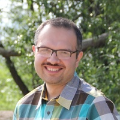
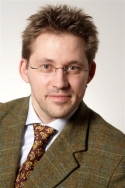
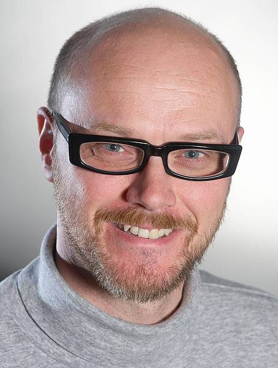

## Keynote Speakers

<table style="border:none; border-collapse:collapse; text-align:center;">
  <tr style="border: none;">
    <td style="border: none; padding:5px;">
      
    </td>
    <td style="border: none; padding:15px;"></td>
    <td style="border: none; padding:5px;">
      
    </td>
    <td style="border: none; padding:15px;"></td>
    <td style="border: none; padding:5px;">
      
    </td>
  </tr>
  <tr>
    <td style="border: none; padding:5px;">
      <a href="#mohammad-reza-mousavi--conformance-testing-as-a-tool-for-designing-connected-vehicle-functions">Mohammad Reza Mousavi</a>
    </td>
    <td style="border: none; padding:15px;"></td>
    <td style="border: none; padding:5px;">
      <a href="#holger-giese--challenges-for-engineering-smart-cyber-physical-systems">Holger Giese</a>
    </td>
    <td style="border: none; padding:15px;"></td>
    <td style="border: none; padding:5px;">
      <a href="#holger-hermanns--foundations-of-perspicuous-software-systems">Holger Hermanns</a>
    </td>
  </tr>
</table>

## Mohammad Reza Mousavi -- Conformance Testing as a Tool for Designing Connected Vehicle Functions

Connected and Autonomous Vehicles (CAV) are taking a central position in the landscape of intelligent mobility and their rigorous verification and validation is one of the main challenges in their public deployment and social acceptance. Conformance testing is a rigorous verification technique that has been widely tried in various critical applications. In this talk, we examin the adaptations and extensions of the notions of conformance and model-based testing techniques that make them suitable for application in the CAV domain. We present how the extended techniques can be used in the design of connected vehicle functions and verify various design decisions.

[__Mohammad Reza Mousavi__](https://www2.le.ac.uk/departments/informatics/people/mohammad-mousavi){:target="_blank"} is a professor of Data-Oriented Software Engineering at University of Leicester, UK. Prior to that, he was professor of Computer Systems Engineering at Halmstad University, Sweden, assistant and associate professor of Computer Science (2005-2013) at TU Eindhoven, and postdoctoral researcher (2006-2007) at Reykjavik University, Iceland. His research interests are in formal semantics and verification and his main current research area is in model-based testing, particularly applied to software product lines and cyber-physical systems.

## Holger Giese -- Challenges for Engineering Smart Cyber-Physical Systems

We currently can observe a transformation of our technical world into a networked technical world where besides the embedded systems with their interaction with the physical world the interconnection of these nodes in the cyber world becomes a reality. This dramatic transformation towards cyber-physical systems raises the question whether our capabilities to design, produce, and operate these future embedded systems are ready to tackle the resulting challenges. In parallel nowadays there is a strong trend to employ artificial intelligence techniques and in particular machine learning to make software behave smart. To support this trend and to unleash their full potential, cyber-physical systems must be able to operate as elements in open, dynamic, and deviating overall structures and to adapt to open and dynamic contexts while being developed, operated, evolved, and governed independently. We name the resulting cyber-physical systems to be smart as they must be self-adaptive at the level of the individual systems and self-organizing at the system of system level to cope with the emergent behavior at that level.

In this presentation we will first discuss the envisioned future scenarios for embedded systems becoming cyber-physical systems with an emphasis on the synergies networking can offer and then characterize which challenges for the design, production, and operation of these systems result. We will then discuss to what extent our current capabilities in particular concerning engineering match these challenges and where substantial improvements for the engineering are crucial. In classical engineering models are used to plan systems upfront to maximize envisioned properties on the one hand and minimize cost on the other hand. When applying the same ideas to software for smart cyber-physical systems, it soon turned out that for these systems often somehow more subtle links between the involved models and the requirements, users, and environment exist.  Self-adaptation and runtime models have been advocated as concepts to covers the demands that result from these links. Lately, both trends have been brought together more thoroughly by the notion of self-aware computing systems. We will review the underlying causes, discuss some our work in this direction, and outline related open challenges and implications for future approaches to engineer such smart cyber-physical systems.

[__Holger Giese__](https://hpi.de/en/giese/staff/prof-dr-holger-giese.html){:target="_blank"} studied technical computer science at the University Siegen. He received his engineering degree with excellence in October 1995. In February 2001, he received a doctorate in Computer Science at the Institute of Computer Science at the University of Münster with summa cum laude. Until 2006, he was an assistant professor for object-oriented specification of distributed systems in the Software Engineering Group of the University of Paderborn. Since 2006, he was a Visiting Professor for System Analysis and Modeling at the Hasso Plattner Institute for Software Systems Engineering. He became a Full Professor for System Analysis and Modeling at the Hasso Plattner Institute for Software Systems Engineering in February 2008.

## Holger Hermanns -- Foundations of Perspicuous Software Systems

The Transregional Collaborative Research Centre 248 „Foundations of Perspicuous Software Systems“ aims at enabling comprehension in a cyber-physical world with the human in the loop. From autonomous vehicles to Industry 4.0, from smart homes to smart cities – increasingly computer programs participate in actions and decisions that affect humans. However, our understanding of how these applications interact and what is the cause of a specific automated decision is lagging far behind. With the increase in cyber-physical technology impacting our lives, the consequences of this gradual loss in understanding are becoming severe. Systems lack support for making their behaviour plausible to their users. And even for technology experts it is nowadays virtually impossible to provide scientifically well-founded answers to questions about the exact reasons that lead to a particular decision, or about the responsibility for a malfunctioning. The root cause of the problem is that contemporary systems do not have any built-in concepts to explicate their behaviour. They calculate and propagate outcomes of computations, but are not designed to provide explanations. They are not perspicuous. The key to enable comprehension in a cyber-physical world is a science of perspicuous computing.

[__Holger Hermanns__](https://depend.cs.uni-saarland.de/~hermanns/){:target="_blank"} is full professor at Saarland University, Saarbrücken, Germany, holding the chair of Dependable Systems and Software on Saarland Informatics Campus. He has previously held positions at Universität Erlangen-Nürnberg, Germany, at Universiteit Twente, the Netherlands, and at INRIA Grenoble Rhône-Alpes, France, and is former Dean of the Faculty of Mathematics and Computer Science at Saarland University.
His research interests include modeling and verification of concurrent systems, resource-aware embedded systems, compositional performance and dependability evaluation, and their applications to energy informatics. He is an outspoken proponent of proactive algorithmic accountability.
Holger Hermanns has authored or co-authored more than 200 peer-reviewed scientific papers (ha-index 92, h-index 48). He co-chaired the program committees of major international conferences such as CAV, CONCUR, TACAS and QEST, and delivered keynotes at about a dozen international conferences and symposia. He serves on the steering committees of ETAPS and TACAS. He is president of the association "Friends of Dagstuhl e.V.", and vice president of the association "ETAPS e.V.".
Holger Hermanns received the Dutch "Vernieuwingsimpuls" and the German "Preis des Fakultätentages Informatik" award. He is an ERC Advanced Grantee and elected member of Academia Europaea, and holds several other national and European research grants.
