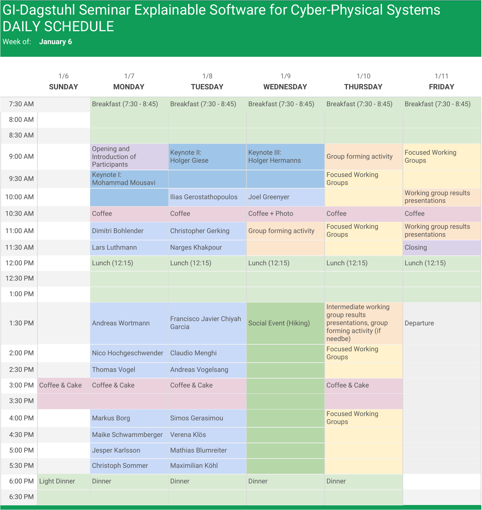

## Schedule

[Download schedule (pdf)](assets/img/ES4CPS-Schedule.pdf)

## Keynotes

* [Mohammad Reza Mousavi: Conformance Testing as a Tool for Designing Connected Vehicle Functions](keynotes#mohammad-reza-mousavi--conformance-testing-as-a-tool-for-designing-connected-vehicle-functions)
* [Holger Giese: Challenges for Engineering Smart Cyber-Physical Systems](keynotes#holger-giese--challenges-for-engineering-smart-cyber-physical-systems)
* [Holger Hermanns: Foundations of Perspicuous Software Systems](keynotes#holger-hermanns--foundations-of-perspicuous-software-systems)

## Position Talks

30 minutes per person, of which 15 minutes should be the presentation time, and 15 minutes should be time for discussion.

### Monday

* [Christopher Gerking](https://www.uni-paderborn.de/person/8391/){:target="_blank"}: Explainability of Cyber-Physical Security Threats ([Abstract](abstracts/Gerking.pdf))
* [Narges Khakpour](https://lnu.se/en/staff/narges.khakpour/){:target="_blank"}: Security Explainability Challenges in Cyber-Physical Systems ([Abstract](abstracts/Khakpour.pdf))
* [Andreas Wortmann](http://www.se-rwth.de/staff/wortmann/){:target="_blank"}: Towards Modeling Languages for Explainable Robotics ([Abstract](abstracts/Wortmann.pdf))
* [Nico Hochgeschwender](http://www.dlr.de/sc){:target="_blank"}: Improving the Explainability of Autonomous and Intelligent
Systems with Conversational Interfaces ([Abstract](abstracts/Hochgeschwender.pdf))
* [Thomas Vogel](http://thomas-vogel.github.io/){:target="_blank"}: Towards Explainable Quality Assurance of Behavioral Requirements
* [Andreas Vogelsang](https://www.dcaiti.tu-berlin.de/people/vogelsang/){:target="_blank"}: Towards Explainable RE Tools ([Abstract](abstracts/Vogelsang.pdf))
* [Markus Borg](https://www.sics.se/people/markus-borg){:target="_blank"}: Explainability First! Cousteauing the Depths of Neural Networks to Argue Safety ([Abstract](abstracts/Borg.pdf))
* [Maike Schwammberger](https://uol.de/csd/persons/maike-schwammberger-msc/){:target="_blank"}: Distributed Controllers for Provably Live and Safe Car
Manoeuvres on Freeways and in Urban Traffic ([Abstract](abstracts/Schwammberger.pdf))
* [Jesper	Karlsson](https://www.kth.se/profile/jeskarl){:target="_blank"}: Formal-methods based motion-planning for mobility-on-demand and its application on fleets of autonomous vehicles -- an ES4CPS problem ([Abstract](abstracts/Karlsson.pdf))

### Tuesday

* [Ilias Gerostathopoulos](http://www4.in.tum.de/~gerostat/){:target="_blank"}: Automated Experimentation for Online Learning and
Adaptation ([Abstract](abstracts/Gerostathopoulos.pdf))
* [Dimitri Bohlender](https://embedded.rwth-aachen.de/doku.php?id=lehrstuhl:mitarbeiter:bohlender){:target="_blank"}: Explainable Restart-Behaviour of Reactive Systems Software ([Abstract](abstracts/Bohlender.pdf))
* [Lars Luthmann](https://www.es.tu-darmstadt.de/es/team/lars-luthmann/){:target="_blank"} and [Malte Lochau](http://www.es.tu-darmstadt.de/es/team/malte-lochau){:target="_blank"}: Model-based Testing Strategies for Configurable Software
with Unbounded Parametric Real-Time Constraints ([Abstract](abstracts/Luthmann.pdf))
* [Francisco Javier Chiyah Garcia](https://scholar.google.co.uk/citations?user=NQyCFjYAAAAJ&hl=en){:target="_blank"}: Explainable Autonomy through Natural Language ([Abstract](abstracts/ChiyahGarcia.pdf))
* [Sebastian Wrede](https://www.cor-lab.de/swrede){:target="_blank"}: Framework-level Resource Awareness for Robotics Systems ([Abstract](abstracts/Wrede.txt))
* [Claudio Menghi](https://www.chalmers.se/en/staff/Pages/menghi.aspx){:target="_blank"}: Strategy Patterns for Multi-Agent CPS ([Abstract](abstracts/Menghi.pdf))
* [Simos Gerasimou](https://www-users.cs.york.ac.uk/simos/){:target="_blank"}: Safety Assurance of Cyber-Physical Systems: Mind the Gap ([Abstract](abstracts/Gerasimou.txt))
* [Verena Klös](https://www.sese.tu-berlin.de/menue/ueber_uns/team/verena_kloes/){:target="_blank"}: Explainable Self-Learning Self-Adaptive Systems ([Abstract](abstracts/Kloes.pdf))
* [Mathias Blumreiter](https://www.tuhh.de/sts/institute/people/mathias-blumreiter.html){:target="_blank"}: Refining incomplete models through system observations
with NuSMV ([Abstract](abstracts/Blumreiter.pdf))
* [Maximilian Köhl](https://www.koehlma.de/){:target="_blank"}: _tba_

### Wednesday

* [Christoph Sommer](http://www.ccs-labs.org/~sommer/){:target="_blank"}: Multi-Technology and Multi-Level Cooperative Mobile Systems in Smart Cities of Tomorrow
* [Joel Greenyer](http://jgreen.de/){:target="_blank"}: _tba_
