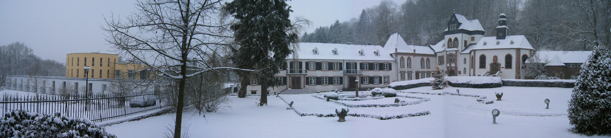

## Schloss Dagstuhl

ES4CPS will take place at [Schloss Dagstuhl](https://www.dagstuhl.de){:target="_blank"}. Upon arrival and to prepare your stay at Dagstuhl, please check the following [page](https://www.dagstuhl.de/en/about-dagstuhl/arrival/planing-your-visit-check-in/){:target="_blank"}.

 &copy; <a href="https://www.dagstuhl.de/ueber-dagstuhl/presse/downloads/" target="_blank" style="color:gray;">Schloss Dagstuhl</a>

## Travel Information

To reach Schloss Dagstuhl from Frankfurt Main Station or Frankfurt Airport, you can take the regional train to Türkismühle (trains run every hour, alternating between a direct connection and a connection requiring a transfer in Mainz; check out [bahn.de](https://www.bahn.com/){:target="_blank"} for connections) and then for the last mile a taxi from Türkismühle to Dagstuhl (20 min. ride). Though it will be likely more expensive, you may also take a taxi directly from Frankfurt Airport.

Taxis should be booked at [Taxi Martin](https://www.dagstuhl.de/en/about-dagstuhl/arrival/taxi-to-dagstuhl/){:target="_blank"} (taxi company cooperating with Schloss Dagstuhl) as people booking for the same time and place will be grouped, which reduces the costs per person. When contacting Taxi Martin, you may also ask about the number of people who have already booked a taxi four your time and place. Prices for taxis are listed on the page linked above.
